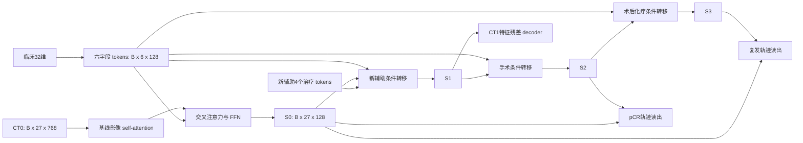

# 多阶段模型 V2：设计依据、逐层结构与实验协议

日期：2026-09-17。本文说明本仓库本次实现，区分代码事实、研究假设与待验证结论。
当前没有依据保证新模型超过旧模型，也不能凭组合已有模块宣称达到 CVPR 的创新要求。

相关实现：

- [模型与前向接口](../src/stageworld/event_v2_models.py)
- [训练目标、检查点选择与恢复](../src/stageworld/event_v2_training.py)
- [固定实验协议](../src/stageworld/event_v2_spec.py)
- [每种子患者划分](../src/stageworld/event_v2_splits.py)
- [原多阶段模型](../src/stageworld/event_models.py)
- [原始多阶段队列约定](EVENT_MULTISTAGE.md)

## 1. 为什么修改这些地方

原模型并不只是一个简单 MLP：它已有四层共享空间转移、三次事件递推、两路注意力读出和辅助 CT1 监督。
问题在于这些结构是否与现有数据提供的监督相匹配。

| 原有设计或数据限制 | 影响 | 本次处理 |
| --- | --- | --- |
| 32维临床数据压成一个128维向量，再广播到全部影像 token | 各临床字段的身份和独立交互不够明确 | 六字段独立 tokenizer，影像 query 对字段 token 做交叉注意力 |
| 三类阶段完全共用转移模块，仅事件条件不同 | 共享有利于小样本，但阶段间的差异主要依赖条件向量 | 保留共享主干，每层增加三个阶段专用的8维瓶颈分支 |
| 终点主要读取一个最终状态 | 基线信息与变化信息混在一起 | 显式读取基线、当前状态及两者差值 |
| 只有 CT0 到 CT1 与终点标签监督 | 651人下容易记忆标签或忽略部分视觉 token | 只在训练集加入 CT0 遮挡特征重建 |
| 单一分类读出 | 小样本预测可能受读出初始化影响 | 四成员参数共享读出，逐成员训练，概率平均 |
| 旧五折中的验证集同时选模型和报告结果 | 结果包含模型选择偏差 | 每种子重新划分训练、验证、测试，全部预定模型选定后才计算测试结果 |

增加层数不是本次目标。默认 V1 有 **2,327,682** 个参数，V2 有 **2,146,058** 个参数；
这两个数字由默认构造函数在 CPU 上实例化统计，包括 V2 仅训练使用的 CT0 重建 decoder，
不包括冻结的外部 Swin，也不计优化器状态和 buffer。V2 并没有靠扩大参数量完成升级。

## 2. 输入与不能输入的内容

设批大小为 B，视觉特征维度为 D=768，隐藏维度 H=128，token 数 N=27，成员数 K=4。

| 输入 | 形状 | 含义 |
| --- | --- | --- |
| `inputs.ct0` | `[B,27,768]` | 冻结外部 Swin 的基线 CT 特征，原始网格为3×3×3 |
| `inputs.x[:, :32]` | `[B,32]` | 性别、年龄、BMI、cT、cN、cM 的现有编码，含缺失信息 |
| `inputs.x[:, 32:]` | `[B,328]` | 四个82维新辅助治疗 token，不含周期 |
| `inputs.events` | `[B,3]`，整数 | 新辅助、手术、术后化疗的 absent/present/unknown/conflict 状态 |
| 训练监督 CT1 | `[B,27,768]` | 仅用于损失和训练统计，不属于前向输入 |
| pCR、记录的复发/转移标签 | `[B,2]` | 仅用于监督和相应分区的指标计算 |

日期、间隔、治疗周期、观察到的术后病理、CT1 和终点标签均不进入预测接口。
治疗事件是给定条件；它们是否在实际部署时已知，仍须按临床使用时点说明。
这里的“因果顺序”仅指后续事件不能改变先前计算出的状态，不代表因果治疗效应已被识别。

临床切片严格沿用 [baseline_clinical.py](../src/stageworld/data/baseline_clinical.py) 的字段顺序：

| 字段 | Python切片 | 宽度 | 独立投影 |
| --- | --- | --- | --- |
| 性别 | `x[:,0:3]` | 3 | `Linear(3,128) → GELU → LayerNorm(128)` |
| 年龄 | `x[:,3:5]` | 2 | `Linear(2,128) → GELU → LayerNorm(128)` |
| BMI | `x[:,5:7]` | 2 | `Linear(2,128) → GELU → LayerNorm(128)` |
| cT | `x[:,7:19]` | 12 | `Linear(12,128) → GELU → LayerNorm(128)` |
| cN | `x[:,19:28]` | 9 | `Linear(9,128) → GELU → LayerNorm(128)` |
| cM | `x[:,28:32]` | 4 | `Linear(4,128) → GELU → LayerNorm(128)` |

六个投影堆叠后加可学习字段身份向量，得到 C=`[B,6,128]`。
这不是把32维平均分成六段，也没有重新定义临床数据编码。

## 3. 整体计算图



所有 S0、S1、S2、S3 均为 `[B,27,128]`。三个阶段使用同一组3层主干参数，
但每层内部有阶段专用 adapter。状态以顺序递推产生，未来事件不参与过去状态的计算。

### 3.1 基线编码：先建模影像，再查询临床字段

1. 只用当前种子的训练 CT0 计算逐通道均值 μ 和标准差 σ，σ 下限为0.05。
2. `Z=(CT0-μ)/σ`，形状仍是 `[B,27,768]`。
3. `Linear(768,128) → LayerNorm(128)`，得到 `[B,27,128]`。
4. 3×3×3归一化坐标经 `Linear(3,128,bias=False)`，加到 token 上。
5. `LayerNorm → MultiheadAttention(128,4 heads)`，Q/K/V均来自27个影像 token，残差相加。
6. `LayerNorm → MultiheadAttention(128,4 heads)`，Q为27个影像 token，K/V为6个临床 token，残差相加。
7. `LayerNorm → Linear(128,512) → GELU → Linear(512,128)`，残差相加，输出 S0。

每个 attention head 的维度是32。基线块没有新增 dropout；分类头保留 dropout=0.1。
V2 没有沿用 V1 的空间深度可分离卷积，采用位置编码与全局 self-attention；
不能把这一变更描述成已经证明更优的空间建模。
BF16 训练中，基线投影后状态显式转 FP32，以减少小门控增量在残差累加中被舍入的风险。

### 3.2 每阶段的条件序列

新辅助治疗信息先由 `[B,328]` reshape 为 `[B,4,82]`，再经过共享
`Linear(82,128) → GELU → LayerNorm(128)`，加四个独立 token 身份向量。

| 阶段 | 条件拼接 | 条件形状 |
| --- | --- | --- |
| 新辅助 | 6个临床 token + 1个该阶段事件 token + 4个治疗 token | `[B,11,128]` |
| 手术 | 6个临床 token + 1个该阶段事件 token | `[B,7,128]` |
| 术后化疗 | 6个临床 token + 1个该阶段事件 token | `[B,7,128]` |

事件 token 仍来自三个独立 `Embedding(4,128)`。`[B,3]` 表示每名患者有三个整数编码；
取出某一列后是 `[B]`，查该阶段 embedding 得 `[B,128]`，增加 token 轴后成为 `[B,1,128]`。
它不是把三种治疗一起压缩成一个 token。

仅 `PRESENT` 执行状态更新。其他编码保留旧状态，unknown/conflict 同时标记病史不完整。
因此非 PRESENT 的 embedding 行没有有效的事件转移监督；本次没有虚构这些事件的训练支持。
手术与术后化疗没有可用详细方案，条件中也没有加入四个全零占位治疗 token。

### 3.3 每个共享转移块：三层主干，每层四条门控残差

对阶段 s 的条件序列先做 `LayerNorm(128)`，记为 C_s。
其 token 均值通过 `Linear(128,512)`，输出四组逐通道门：

```text
c_s = mean_tokens(LayerNorm(C_s))                 [B,128]
[g_attn,g_cross,g_ffn,g_adapter]
    = split(0.25 * sigmoid(Linear(c_s)), 4)      4 x [B,128]
```

该线性层权重初始化为0，偏置初始化为-2；初始门约为0.0298，每个门在0与0.25之间。
这是有界残差门控，不是完整 AdaLN：当前代码没有额外预测 LayerNorm 的 shift/scale。
门控抑制单条分支的初始幅度，但不能据此宣称整个转移是收缩映射或已有稳定性证明。

每层按以下顺序执行，输出形状始终为 `[B,27,128]`：

```text
U1 = U  + g_attn   * SelfAttention(LN1(U), LN1(U), LN1(U))
U2 = U1 + g_cross  * CrossAttention(LN2(U1), C_s, C_s)
U3 = U2 + g_ffn    * Linear_512_to_128(GELU(Linear_128_to_512(LN3(U2))))
U4 = U3 + g_adapter* Up_s(GELU(Down_s(LN4(U3))))
```

`Down_s:128→8`、`Up_s:8→128` 均不带偏置；两矩阵使用标准差0.02的小随机初始化。
每个阶段分支有2,048个参数，3个阶段×3层总计18,432个参数。
因为包含 GELU 且共享主干也训练，这是阶段专用非线性瓶颈 adapter，不能称严格复现 LoRA。

3层完成后用逐患者 `where(event==PRESENT,candidate,previous)` 写回。
跳过事件时状态必须逐元素等于旧状态，不能只靠门接近零。
显式输出 `stage_increments=states[:,1:]-states[:,:-1]`，形状为 `[B,3,27,128]`；
它是模型潜变量变化，不等于可解释的病灶变化量或治疗因果效应。

### 3.4 CT1 decoder：预测特征，不生成 CT 图像

S1 经 `LayerNorm(128) → Linear(128,256) → GELU → Linear(256,768)`，
得到 `[B,27,768]` 的归一化特征增量，输出为：

```text
CT1_hat = CT0 + decoder(S1) * sigma
```

最后一层权重初始标准差0.001。偏置由训练患者有效 CT1 与 CT0 的平均特征差初始化；
这是训练监督的一部分，不能用验证或测试 CT1 计算。
输出仍是冻结 Swin 的特征张量，不是像素、体素或可直接解释的解剖图像。

### 3.5 轨迹读出：81个 token，384维读出，四成员分类

pCR 使用 `(S0,S2)`，复发使用 `(S0,S3)`，两个头完全独立。
对每个头设基线 U0、当前 U_t 和差值 Δ=U_t-U0：

1. 三组27个 token 分别加各自类型向量，拼接为 `[B,81,128]`，随后 LayerNorm。
2. 可学习 query 加 `Linear(LayerNorm(mean(C)))`，得到临床条件 query `[B,1,128]`。
3. 4头注意力从81个 token 读取信息，再加 query 残差，输出 `[B,1,128]`。
4. 拼接 query、当前状态均值、差值均值，得到 `[B,384]`。
5. expand 为 `[B,4,384]`，进入以下参数共享成员网络：

```text
BatchEnsembleLinear(384,128)
→ LayerNorm(128) → GELU → Dropout(0.1)
→ BatchEnsembleLinear(128,64) → GELU
→ BatchEnsembleLinear(64,1)
→ [B,4]
```

每个 ensemble 层的具体公式为 `y_k=W(x_k*r_k)*s_k+b`；W和偏置b共享，
输入/输出 scaling 为各成员独有，初始为 `Normal(1,0.1)`。
这与官方 TabM 的第一层随机 scaling、后续单位 scaling、成员偏置等细节不同，
因此只称 TabM/BatchEnsemble 启发的读出，不能称完整 TabM 复现。

两个终点合并的 `member_logits` 形状为 `[B,2,4]`。
推理采用 `p=mean_k(sigmoid(logit_k))`；对外兼容的单一 logit 为 `log(p)-log(1-p)`，
代码用 log-sigmoid/logsumexp 稳定计算，避免饱和概率转 logit。
同时记录成员概率方差，名称为 `member_disagreement`，不视为已校准的不确定性。

### 3.6 遮挡辅助项：只重建基线，目标没有复制通道

每个训练 batch 对 CT0 的27个 token 独立以0.25概率遮挡。
在线性投影之后、位置编码与基线 attention 之前，用 learned mask token 替换被遮挡位置。
仍通过同一基线 self-attention、clinical cross-attention 和 FFN。

独立 `source_decoder` 使用 `LN128→Linear256→GELU→Linear768`；
只在被遮挡位置计算与标准化原 CT0 的 SmoothL1。目标显式 `detach()`。
这个辅助分支没有 `+CT0` 残差，防止把被遮挡目标直接复制到输出；无被遮挡位置时返回0。
它不递推治疗阶段，不使用 CT1，不使用验证/测试患者，也不在常规预测时执行。
Swin 特征本来已经冻结，因此本实现没有 EMA 教师。

## 4. 训练目标的准确含义

CT0/CT1 的 crop 对应关系未经证实，因此 CT1 监督沿用
[feature_set_loss](../src/stageworld/generated700_models.py)，而不是逐位置重建：

```text
L_CT = SmoothL1(mean(P),mean(Y)) + 1-cos(mean(P),mean(Y))
     + 0.25 * mean((sort(P R)-sort(Y R))^2)
     + 0.10 * SmoothL1(std_tokens(P),std_tokens(Y))
```

R为固定64个单位随机投影方向；P为预测特征集，Y为 detached 的有效 CT1 特征集。
损失对患者内部 token 排列不敏感，不代表学习到解剖对应、确定的病灶迁移或最优治疗路径。
没有有效 CT 标签时 CT 项为0；二分类标签也使用各自有效性掩码。

对成员 k 单独计算 BCE，再平均成员损失。pCR 使用普通 masked BCE；
复发的正样本权重 `w+=训练集负样本数/正样本数`，其余样本权重为1，
每个成员的损失除以有效样本权重总和。

```text
L_pretrain = L_CT + 0.5 * mean_k(L_pCR,k) + 0.05 * L_mask
L_joint    = mean_k(L_recurrence,k) + 0.5 * mean_k(L_pCR,k)
           + 0.1 * L_CT + 0.05 * L_mask
```

V1没有遮挡辅助项且成员数为1。不是先平均 logits 再计算一次 BCE。
加权 BCE 的输出不可直接解释为校准后的临床发生概率；本轮不做测试集校准或阈值调整。

预训练选择最小验证 `L_CT+0.5*mean_k(L_pCR,k)`，不计算随机遮挡验证损失；
联合训练选择最高验证复发 AUPRC。pCR 是辅助终点，没有另一套按 pCR 独立挑选的最佳模型。

AdamW、weight decay=0.01、batch=32、梯度裁剪=1；预训练学习率0.0002，
联合训练主干0.00002、两个读出头0.0002，无学习率 scheduler。
每阶段最多100 epochs，patience=15、min_delta=0.0001；raw-best 检查点选择与显著改善早停分开。
正式训练使用 BF16 CUDA，评估使用 FP32；CPU路径服务于合成验证，不表示正式训练已在 CPU 跑完。
每个种子的联合阶段只加载该种子、该模型家族本轮选定的预训练检查点，不能加载旧队列训练权重。

## 5. 每个种子内部的8:1:1与测试封存

预定种子为 `17,43,97,131,173,211,257,307,359,419`。
每个种子独立完成患者级划分：**521训练、65验证、65测试**，三组互斥、合计651人。
整数取整规则是两个10%分区各取 `floor(651/10)=65`，余下521人归训练。

划分前稳定排序患者标识；按 `pCR+2*recurrence` 的联合标签分层，
先拆521/130，再把130人拆65/65。分层只为分配数据，不拟合模型。
不因结果不好更换随机种子，不自动回退到较宽松的分层方式。

本轮主比较预先固定为 `event_v1` 与 `event_v2`，两者使用完全相同的各种子划分。
共2模型×10种子×2阶段=40个拟合阶段。
所有预定模型、所有种子的预训练和联合训练选择完成并固定后，才打开测试评估。
训练器仅收到移除测试患者后的 development pool，并验证训练与验证正好覆盖该 pool。
所有填补、归一化、类别权重和 CT decoder 偏置只由训练患者拟合。

两个终点均保留独立的普通和正类平衡 logistic regression 作为参考，C固定为1，
使用训练集拟合的临床/治疗/事件编码；平衡权重也仅由训练标签确定。
它们不与神经网络 logits 混合，也不用来选择神经网络。
固定阈值0.5；测试患者不选择 epoch、网络、成员数、阈值、校准参数或最佳种子。

逐种子报告两模型的测试指标及配对差值；不能挑最好种子，也不能把10个测试集预测简单拼成650名独立患者。
不同种子的测试集可以重叠，模型训练集也大量重叠。跨种子均值或区间即使另行汇总，
也应注明它们描述划分和初始化敏感性，而不是10个独立外部中心的证据。

更重要的是：这651人已参加先前开发。新的测试拆分隔离了本轮拟合与选择，
但不能逆转以往对这批数据的研究使用，因此属于**回顾性内部留出评估**，不是全新未见队列。

## 6. 文献、官方代码与移植边界

以下来源于2026-09-17实际读取的论文平台、作者仓库和许可证；未下载上游权重或私有数据。
本模型是独立的任务适配实现，不是下列任一论文的完整复现。

| 方法 | 已核实发表信息 | 官方代码与关键位置 | 许可证与本次用途 |
| --- | --- | --- | --- |
| DINO-WM | [ICML2025论文集](https://proceedings.mlr.press/v267/zhou25t.html) | [gaoyuezhou/dino_wm](https://github.com/gaoyuezhou/dino_wm)，`models/visual_world_model.py::VWorldModel`、`models/vit.py` | MIT；冻结视觉特征、动作条件和顺序预测。其 matched-patch MSE不直接照搬到未配准CT |
| DINO-Foresight | [NeurIPS2025](https://openreview.net/forum?id=gimtybo07H) | [Sta8is/DINO-Foresight](https://github.com/Sta8is/DINO-Foresight)，`src/dino_f.py::get_mask_tokens/forward_loss`、`src/attention_masked.py` | MIT；冻结特征的masked prediction。本次只增加CT0同次扫描的遮挡重建，不声称复现视频预测 |
| TabM | [ICLR2025](https://openreview.net/forum?id=Sd4wYYOhmY) | [yandex-research/tabm](https://github.com/yandex-research/tabm)，`tabm.py::LinearBatchEnsemble`、`MLPBackboneBatchEnsemble`、`example.ipynb` | Apache2.0；参考共享权重成员调制、独立成员loss、推理概率平均；初始化和偏置不同 |
| DiT | [ICCV2023](https://openaccess.thecvf.com/content/ICCV2023/html/Peebles_Scalable_Diffusion_Models_with_Transformers_ICCV_2023_paper.html) | [facebookresearch/DiT](https://github.com/facebookresearch/DiT)，`models.py::DiTBlock` | CC-BY-NC；仅借鉴条件残差门控思想，没有粘贴代码、采用扩散或完整adaLN |
| LoRA | [ICLR2022](https://openreview.net/forum?id=nZeVKeeFYf9) | [microsoft/LoRA](https://github.com/microsoft/LoRA)，`loralib/layers.py::Linear` | MIT；参考小规模分解更新；当前是带GELU的阶段adapter，并且主干也训练 |

最新研究中还核实了两个需要区别对待的方向：

- [SALT: Rethinking JEPA](https://openreview.net/forum?id=3cB9243E9i) 为 ICLR2026 Poster，
  研究冻结教师的 masked latent prediction。本次未确认作者官方公开实现，因此只作为研究背景，
  不宣称本项目复用了 SALT 代码。
- [V-JEPA2 / V-JEPA2.1](https://github.com/facebookresearch/vjepa2) 官方仓库含2026-03-16发布的2.1，
  `src/models/ac_predictor.py` 有 action/state token 与因果mask，2.1讨论 dense prediction 和 deep supervision。
  本次只核实到[2的预印本](https://arxiv.org/abs/2506.09985)和[2.1的预印本](https://arxiv.org/abs/2603.14482)，
  不能把它们写成已核实顶会论文。仓库主要代码MIT，部分文件另有Apache说明，应按具体文件许可证处理。

这些工作支持一个判断：冻结高质量特征加紧凑预测器本身不“落后”。
是否构成新的研究贡献，要看当前临床问题中的新机制、合理假设与可重复证据。

## 7. 尚未解决的数据与识别问题

1. 选定651人全部有手术和记录的术后化疗。网络可学习三个计算阶段，
   但不能由此估计“做与不做手术/术后化疗”的因果差异，也不能验证这些反事实。
2. 没有术后方案细节和S2/S3实测影像。S2/S3主要受终点标签间接约束，潜在状态不唯一，
   阶段命名或小adapter并未解决其可识别性。
3. 五名患者的记录复发发生于手术之前或当天。现有终点应称“记录的复发/转移状态”，
   不能称严格的治疗后新发复发风险。时间清理应作为另一个预先定义的临床研究协议。
4. CT0/CT1未确认配准，set loss保护了监督假设，但无法保证病灶位置对应。
5. 每个测试集只有65人，阳性数较少，AUROC/AUPRC及阈值指标可能明显波动。
6. attention权重、潜状态差分、ensemble分歧均不是天然的临床解释或校准概率。

## 8. 面向 CVPR 的研究路线与消融

可检验的核心问题应是：**低样本、未配准纵向影像中，显式保留基线的条件状态变化，
能否比静态预测与完全共享转移更稳定地利用治疗前影像？**
目前实现是为检验该问题建立的工程基线，不宜先给其贴“全新世界模型”的结论。

本轮首先在固定的40个拟合阶段完成 V1/V2 主比较。
代码还支持下列家族，但“支持运行”不等于“已完成训练”：

| 消融家族 | 唯一预期改动 | 主要检验的问题 |
| --- | --- | --- |
| `event_v2_no_adapter` | 删除各阶段专用瓶颈分支，保留条件共享主干 | 阶段适配是否优于仅提供阶段条件 |
| `event_v2_no_mask` | 关闭训练中的CT0遮挡loss | 遮挡辅助项是否改善小样本表示 |
| `event_v2_single_member` | 成员数4改为1，其余训练规则不变 | 改善来自状态模型还是分类集成 |

模块层还支持 `no_transition`，但它未列入当前正式家族；静态影像加临床基线、
去掉基线/差值读出、去CT1辅助监督、参数量匹配控制都应作为后续预注册实验。
若在本轮测试揭晓后决定这些实验，应把它们明确标成探索性，不能再称原始封存测试上的确认性消融。

更接近投稿要求的后续证据包括：

- 外部中心或时间外队列，独立冻结方案与阈值，避免只在651人上反复调整。
- 证明影像实际贡献：临床logistic、静态影像模型、V1、V2在相同患者划分比较。
- 证明所称的变化建模：生成CT1特征优于复制CT0和训练均值，且这种改善与终点表现有关。
- 报告各种子结果、类别支持数、失败案例和置信区间，不能只选择最佳AUROC。
- 检验输入扰动、缺失字段、去治疗条件与合理的负对照；不把患者间任意打乱治疗当成已识别的反事实。
- 如要提出因果治疗规划，先补齐治疗方案、时间、未治疗对照和混杂信息，再设计对应识别假设与评价。

条件门控、低秩分支和集成各自都不是新颖性。
若未来确有稳定效果，贡献应落在明确的问题定义、与数据限制匹配的学习机制，以及跨队列可检验的结论上。

## 9. 当前验证状态

本文所列维度、门控公式、损失权重和默认参数数目已对照当前实现；CPU实例化完成。
正式软件验证、远端运行状态和训练结果由本次执行报告另行记录。
在真实训练与测试完成前，本文不报告提升数值，不把合成测试通过写成临床有效性证明。
