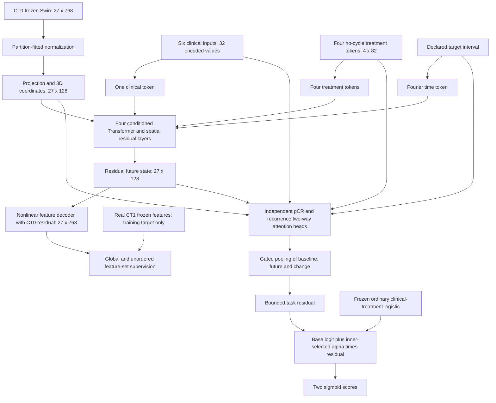

# Generated V2 Architecture

The three joint variants share this architecture. Only masked classification
loss differs: ordinary BCE, positive-weighted BCE, or positive-weighted focal.
An additional frozen-world BCE arm controls whether joint adaptation helps.

There are1,408,000 generator and1,234,690 endpoint parameters. The external Swin
is cached and frozen, excluded from these counts. No online CT encoder or pixel
decoder is trained. The two heads are separate; joint variants share and update
the generator, so they can still interact through its gradients.

CT1 supervision is detached and only uses the current fitting partition. Global
SmoothL1+cosine is augmented by0.25 sliced distribution distance on64 fixed unit
directions and0.1 feature-spread SmoothL1. Token order is irrelevant to targets.
The classification sum is augmented by0.1 CT loss in joint variants. Target
interval is an explicit scenario input, never survival or follow-up duration.

Missing CT0 masks the residual, yielding the clinical base. Missing CT1 masks
only the auxiliary objective. Missing pCR masks that endpoint loss. Inner-only
alpha in0/.25/.5/1 is saved in the inference bundle. Alpha0 means this endpoint
uses the base model for that fold; it must not be presented as a generated gain.

Attention fastpath is disabled in training evaluation, checkpoint contracts and
standalone inference after same-weight CPU/GPU replay identified fused-kernel
numerical drift. Optimizer training precision remains BF16, evaluation FP32.
